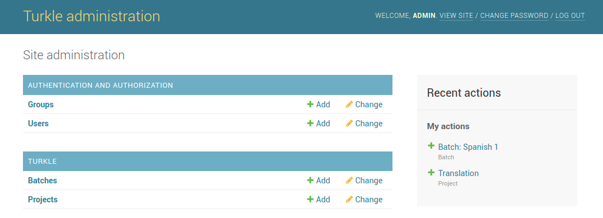
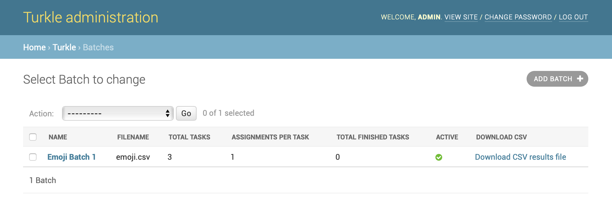

Requestors
==========

Requesters primarily manage **Projects** and **Batches**. The projects
contain the user interface of tasks defined in an HTML template. The
batches are created with CSV files that define the data of the tasks.
Requesters can also create user accounts for workers and assign them
to groups.

|Turkle admin|

Creating groups
---------------

A group contains a set of workers. Projects can be restricted to particular
groups. Create a group from the administration home by clicking on the
``Add`` button for ``Groups``, entering a unique group name, and selecting the
workers that belong in the group.

Creating users
--------------

To create worker user accounts, click the ``Add`` button for ``Users`` and
enter their information. Workers can be also be assigned to groups
on this page.

Creating projects
-----------------

It is best that you design the HTML template with an editor first before
creating the project. There are example templates in the ``examples`` directory
and documentation in the :doc:`template guide <TEMPLATE-GUIDE>`.
When you click on the ``Add`` button for ``Projects``, you will be able to
upload the template and configure other aspects of the project. The
user interface defined by the template cannot be previewed until a batch of
tasks are created. When creating a new project, you will often want to set
the project to be inactive until you have perfected the template and previewed
it.

Creating batches
----------------

A batch of tasks is created from a CSV file. There are multiple ways to 
get to the page for adding a new batch. We recommend viewing all projects
and then clicking the ``Publish Tasks`` button for the project.
Then upload the CSV file and set its attributes. Upon saving the batch,
you will see a preview of the tasks created.

Downloading results
-------------------

To download the annotations of a batch of tasks, navigate to the ``Batches``
page in the administration site. For each batch, there are buttons for 
downloading the results as a CSV file.

|Batch list|

Output CSV Format
`````````````````

Each row of the CSV results file contains 
the template variable input fields, the Worker-submitted form fields,
and some metadata fields.  For each template variable ``${foo}``, the
CSV file will contain a column named ``Input.foo``.  For each submitted
form field named ``bar``, the CSV file will contain a column named ``Answer.bar``.
The CSV file will also have the fields:

- ``HITId`` - Task ID
- ``HITTypeId`` - Project ID
- ``Title`` - Project name
- ``CreationTime`` - Time when the Task was created from CSV input file
- ``MaxAssignments`` - Number of *requested* Assignments per Task
- ``AssignmentDurationInSeconds`` - Amount of time before a Task
  Assignment expires
- ``AssignmentId`` - Task Assignment ID
- ``WorkerId``
- ``AcceptTime`` - Time when User accepted an Assignment for a Task
- ``SubmitTime`` - Time when User submitted an Assignment for a Task
- ``WorkTimeInSeconds`` - Length of time between when User accepted
  a Task Assignment and when User submitted that Assignment
- ``Turkle.Username`` - Username of User who completed Assignment


Scripts for requesters
----------------------

Adding users
````````````

The ``scripts/add_user.py`` script adds a single user. Run it with the ``-h`` option for details.

The ``script/import_users.py`` script reads a CSV file to add users to Turkle.
The file must be formatted like::

    username1,password1
    username2,password2

To support password resets, add an additional column for email
address::

    username1,password1,email1@example.com
    username2,password2,email2@example.com

Adding tasks
````````````

With an HTML template file and a CSV Batch file, use the
``script/upload_tasks.py`` script to:

- create a new Project using the HTML template file, and
- publish a Batch of Tasks using the rows of the CSV file

If you have already created a Project using an HTML template, you
should use the admin UI to publish additional Batches of Tasks.

Downloading results
```````````````````

The ``scripts/download_results.py`` script downloads all Tasks that have been completed
into a directory that the user selects.



